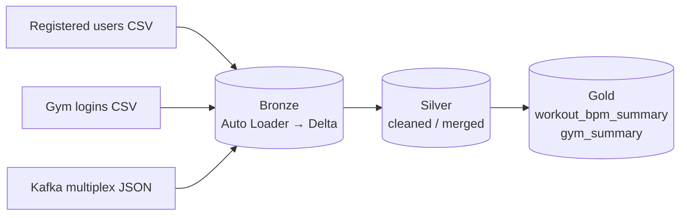

# 🏥 Health Analytics Lakehouse (V2)

A modular Python package for a **Databricks + Delta Lake** pipeline that processes wearable-device health data (heart rate, workouts, gym check-ins, user profiles) through a **Medallion Architecture** (Bronze → Silver → Gold).

> **V2 is a refactor of [V1](https://github.com/GiridharReddy-T/Real-Time-Health-Analytics-Lakehouse-Platform).** V1 is a notebook-based capstone with the complete Bronze/Silver/Gold logic, Databricks Asset Bundle deployment and integration tests. V2 moves the code into an importable, unit-testable `src/` package with CI. **V2 is a work in progress**, see [Project Status](#-project-status).


---

## 📌 Overview

Users wear a health-monitoring wristband that sends heart rate, workout start/stop events and gym check-ins. The platform is designed to produce two gold-layer outputs:

| Output | Description |
|---|---|
| `workout_bpm_summary` | Per-session min / avg / max heart rate with user demographics |
| `gym_summary` | Per-visit minutes in the gym vs. minutes actively exercising |

## 🏗️ Architecture



All tables live in Unity Catalog under `<catalog>.<db_name>` and are stored in ADLS Gen2 (`raw`, `delta` and `checkpoints` containers).

| Layer | Tables |
|---|---|
| **Bronze** | `registered_users_bz`, `gym_logins_bz`, `kafka_multiplex_bz` (partitioned by `topic`, `week_part`; every row carries `load_time` and `source_file`) |
| **Silver** | `users`, `gym_logs`, `user_profile`, `heart_rate`, `workouts`, `completed_workouts`, `workout_bpm`, `user_bins`, `date_lookup` |
| **Gold** | `workout_bpm_summary` (table), `gym_summary` (view) |

## 📁 Project Structure

```
Health-Analytics-V2/
├── src/
│   ├── config.py          # Config: env, ADLS paths, Key Vault-backed secrets
│   ├── setup.py           # SetupHelper: create / validate / clean up database and tables
│   ├── ingestion.py       # BronzeIngestor: Auto Loader streams → bronze tables
│   ├── transformation.py  # SilverTransformer: cleaning rules + users upsert
│   ├── analytics.py       # GoldAnalytics: BPM summary table + gym summary view
│   └── utils.py           # Logger, schema validation helper
├── tests/                 # pytest suite (Spark/dbutils mocked in conftest.py)
├── notebooks/             # Databricks notebook wrappers
├── 01_Setup.py            # Entry point: setup → bronze ingest → validate
├── 01_Run_Pipeline.py     # Entry point: setup + validate
├── .github/workflows/main.yml   # CI: unit tests on push / PR
├── pyproject.toml
└── LICENSE
```

## ⚙️ Configuration

`Config` reads:

| Variable | Default | Purpose |
|---|---|---|
| `APP_ENV` | `dev` | Environment name |
| `DB_NAME` | `project_db` | Schema name |
| `CATALOG_NAME` | `dev_catalog` | Unity Catalog (set by DABs per target) |

Storage paths are built from the `datazone` storage account (`abfss://raw@…`, `abfss://delta@…`, `abfss://checkpoints@…`). Secrets (`db-password`, `kafka-key`) are read from the Databricks secret scope `health-secrets`. Never commit credentials.

## 🚀 Getting Started

**Prerequisites:** a Databricks workspace with Unity Catalog, an ADLS Gen2 storage account with `raw`, `delta` and `checkpoints` containers, and a `health-secrets` secret scope.

1. Clone the repo into **Databricks Repos**.
2. Land source files in the `raw` container under `registered_users_bz/`, `gym_logins_bz/` and `kafka_multiplex_bz/`.
3. Run `01_Setup.py` to create the schema and tables and run the Bronze ingest once.

**Local development**

```bash
pip install pyspark pytest pytest-mock databricks-sdk
PYTHONPATH=. python -m pytest tests -v
```

## 🧪 Testing & CI/CD

- `tests/` holds config, transformation, ingestion and analytics tests. Spark and `dbutils` are mocked in `tests/conftest.py`, so they run without a cluster.
- `azure_pipeline.yml` runs in Azure DevOps with 3 stages:

| Stage | Trigger | Action |
|---|---|---|
| **CI** | every push + PR to `main`/`develop` | install deps, run pytest, publish results |
| **Deploy Test** | merge to `main` (non-PR) | `databricks bundle deploy --target test` → `test_catalog` |
| **Deploy Prod** | push of `v*` tag (e.g. `v1.0.0`) | `databricks bundle deploy --target prod` → `prod_catalog` (requires approval) |

**Required ADO setup** (one-time):
1. In **Pipelines → Variables**, add `DATABRICKS_HOST` (plain) and `DATABRICKS_TOKEN` (secret, lock icon)
2. In **Pipelines → Environments**, create `test` and `production` environments. Add an approval check to `production` to gate prod deploys.
3. Run `conf/create_test_prod_catalogs.sql` as a workspace admin to create `test_catalog` and `prod_catalog`.

## 📦 Environments (DABs)

The project uses a Declarative Automation Bundle (`databricks.yml`) for multi-environment deployment:

```bash
# Deploy manually
databricks bundle deploy --target dev    # → dev_catalog.project_db   (default)
databricks bundle deploy --target test   # → test_catalog.project_db
databricks bundle deploy --target prod   # → prod_catalog.project_db
```

Each target deploys a `[env] Health Analytics Pipeline` job with the correct catalog injected via `--catalog` / `--env` arguments.

## 📊 Project Status

| Area | Status |
|---|---|
| Table DDL, setup / validate / cleanup | ✅ Implemented |
| Bronze ingestion (3 Auto Loader streams) | 🟡 Implemented, being stabilised |
| Silver | 🟡 Cleaning rules written; only the `users` merge stream is wired |
| Gold | 🟡 SQL written; not yet validated against populated tables |
| Integration tests, test data, producer | 🔲 In V1, not yet ported |
| Deployment (Declarative Automation Bundle) and CD | ✅ DABs + Azure DevOps 3-stage CI/CD |

## 🗺️ Roadmap

- [ ] Wire all Silver streams: CDC merge for `user_profile`, dedup merges, `completed_workouts` and `workout_bpm` stream-stream joins
- [ ] Port the V1 integration tests, sample data and producer
- [x] Add `databricks.yml` and a CD workflow (dev → test → prod)
- [ ] Data quality checks, monitoring and alerting
- [ ] Replace placeholder unit tests with real Spark-backed tests

## 🙋 Author

**Giridhar Reddy T**: [LinkedIn](https://www.linkedin.com/in/giridhar-reddy-tatiparthi-272b94244/) · [GitHub](https://github.com/GiridharReddy-T) · [Portfolio](https://giridharreddy-t.github.io/)

## 📄 License

[MIT](LICENSE)
